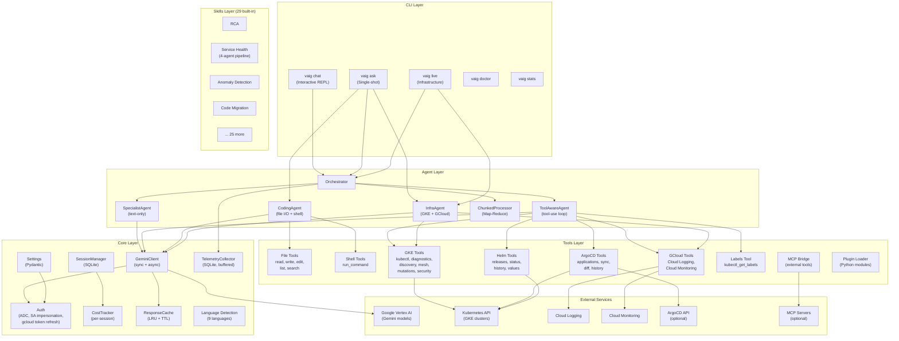
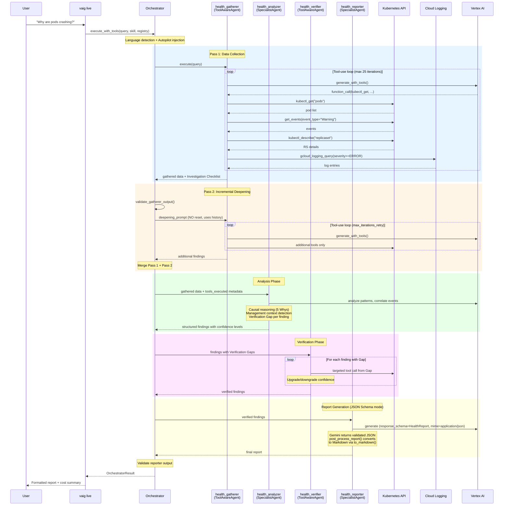
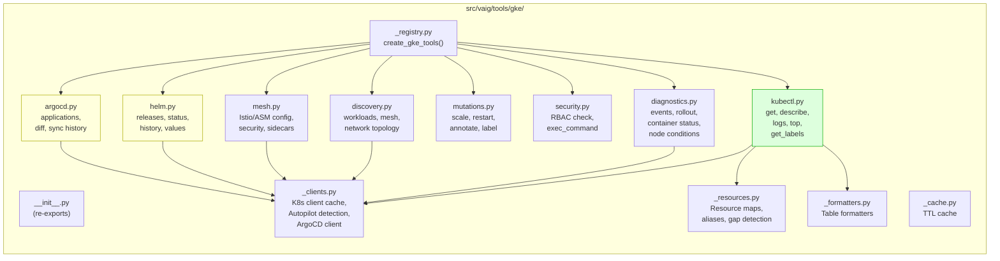
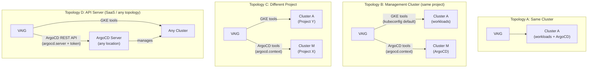
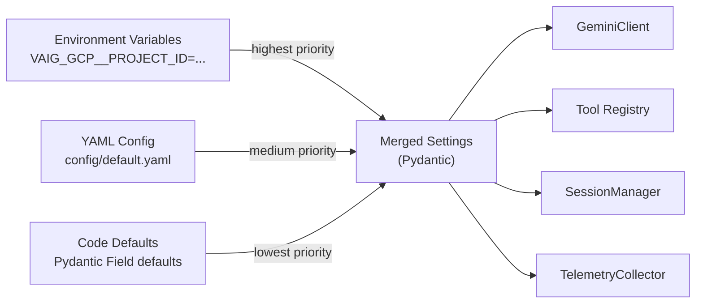
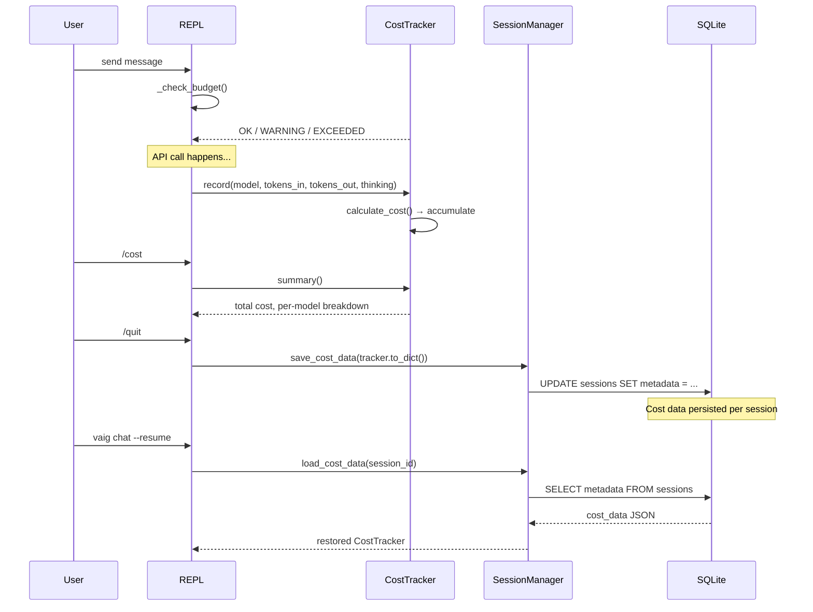

# Architecture

This document describes the system architecture of VAIG using Mermaid diagrams.

## High-Level Architecture

## Service Health Pipeline (4-Agent Sequential)

## Tool Layer — GKE Package Structure

## ArgoCD Connection Topologies

## Configuration Layering

## Cost Tracking Flow

